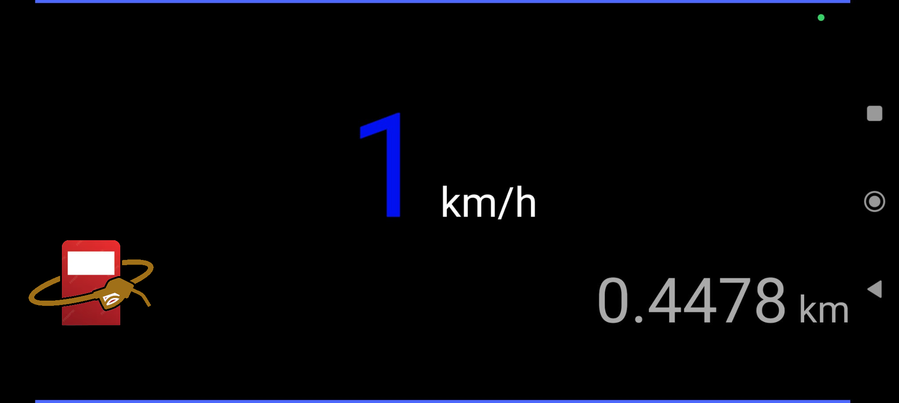

##  Blue Square Speedometer

Simple speedometer & GPS viewer for Android

### Releases
Available at:

- https://play.google.com/store/apps/details?id=net.nhiroki.bluesquarespeedometer
- https://f-droid.org/en/packages/net.nhiroki.bluesquarespeedometer/

### Screenshots
 

### Alternatives
* [Stateful Speedometer](https://f-droid.org/packages/com.github.timboode.statefulspeedometer/) fork that adds color-coding for speeds, total distance travelled
   tracking, and configurable warnings on when to go fill up on gas.
* [Status Bar Speedometer](https://f-droid.org/packages/ch.rmy.android.statusbar_tacho/)
* [Kotori](https://f-droid.org/packages/dev.melonpan.kotori/)
